## `README.md` Template Phase 1: API Plan
`Hi, my name is Anu'

# Crowdfunding Back End
CountOnMe - Support a cause. Make it count.

## Planning:
### Concept/Name
CountOnMe is a full-stack crowdfunding platform designed to connect people with causes, projects, and ideas they care about. It provides a space where users can create fundraisers and where supporters can pledge their help, making it easy to turn small contributions into meaningful impact.

This project was built using **Django REST Framework** for the backend API and **React** for the frontend.

### Intended Audience/User Stories
    As a user, I want to create a login
    As a user, I want to create a fundraiser when logged in 
    As a user, I want to update a fundraiser
    As a user, I want to see the list of all fundraisers + resp pledges
    
    As a user, Only I shoud be able to delete a pledge on fundraisers I own.

    As a supporter, I want to pledge to a fundraiser without logging in

### Front End Pages/Functionality
- Home page
    - List of Fundraisers
    - Click to view Fundraiser details
    - Make a Pledge
    - Login/Register
- Fundraiser Page(Logged in)
    - Fundraiser details
    - All the pledges made for that fundraiser
    - Create a Fundraiser
    - Make a pledge
    - Delete a pledge
- Login/Register
    - Register - if a user is new
    - Login - if the user is already registered

### API Spec

| URL             | HTTP Method | Purpose                     | Request Body        | Success Response Code | Authentication/Authorisation |
| --------------- |------------ | --------------------------- | ------------------- | --------------------- | ---------------------------- |
| /fundraisers/   |GET          |Get all fundraisers          |N/A                  |200                    |None                          |
| /fundraisers/1/ |GET          |Get fundraiser with pledges  |N/A                  |200                    |None                          |
| /fundraisers/   |POST         |Create a new fundraiser      |Fundraiser object    |201                    |Logged In                     |
| /fundraisers/1  |PUT          |Update a fundraiser          |Fundraiser object    |200                    |Logged In                     |
| /fundraisers/1  |DELETE       |Delete a fundraiser          |N/A                  |200                    |Logged In/Owner               |
| /pledges/       |GET          |Get all pledges              |N/A                  |200                    |None                          |
| /pledges/       |POST         |Create a new pledge          |Pledge object        |201                    |None                          |
| /pledges/1      |DELETE       |Delete a pledge              |N/A                  |200                    |Logged In/Fundraiser Owner    |
| /users/         |GET          |Get all users                |N/A                  |200                    |None                          |
| /users/1        |GET          |Get an user                  |N/A                  |200                    |None                          |
| /users/         |POST         |Create a new user            |User object          |201                    |Logged In                     |
|/api-token-auth/ |GET          |Get auth token for a user    |User object          |200                    |None                          |

### DB Schema
- CustomUser
    - id (PK)
    - username
    - password
    - email
- Fundraiser
    - id (PK)
    - title
    - description
    - goal
    - image
    - is_open
    - date_created
    - owner_id (FK → CustomUser.id)
- Pledge
    - id (PK)
    - amount
    - comment
    - anonymous
    - fundraiser_id (FK → Fundraiser.id)
    - supporter_id (FK → CustomUser.id, NULLABLE)

- Relationships:
    - One CustomUser ➝ many Fundraisers (as owner)
    - One CustomUser ➝ many Pledges (as supporter)

- Relationship Summary (Cardinality)
    - CustomUser 1 ────< Fundraiser
    - CustomUser 1 ────< Pledge
    - Fundraiser 1 ────< Pledge

- [x] A link to the deployed project.
https://countonme-c2d7652322c9.herokuapp.com/
- [x] A screenshot of Insomnia, demonstrating a successful GET method for any endpoint.
Get All Fundraisers:

- [x] A screenshot of Insomnia, demonstrating a successful POST method for any endpoint.
Create a pledge:
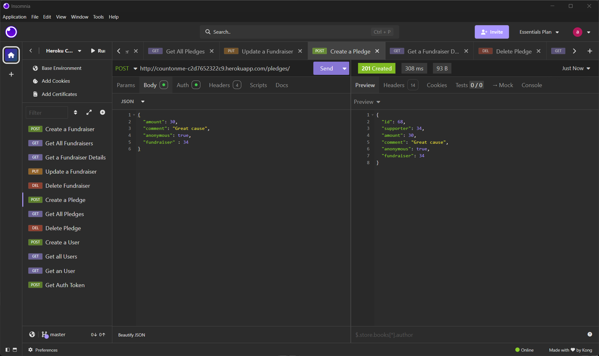
- [x] A screenshot of Insomnia, demonstrating a token being returned.
Create a token for an user:
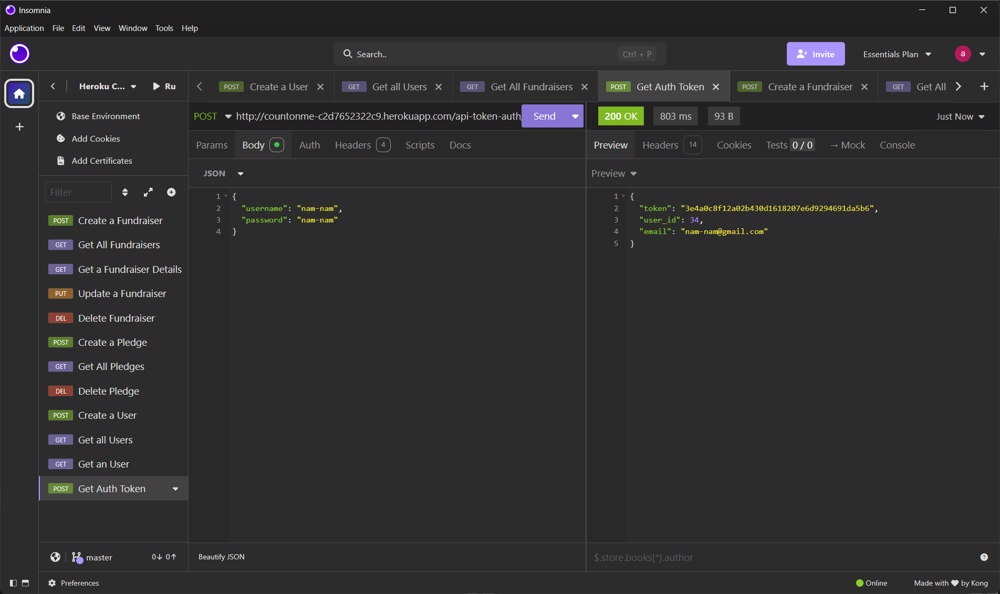
- [x] Step by step instructions for how to register a new user and create a new fundraiser (i.e. endpoints and body data).
Create an User:
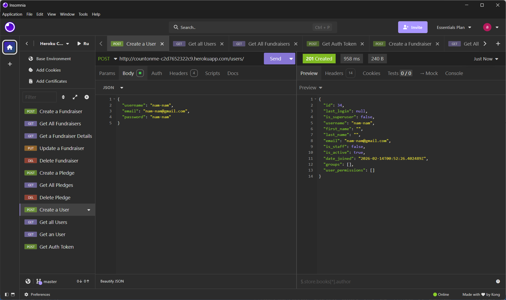
Newly created user returned in 'Get all Users':
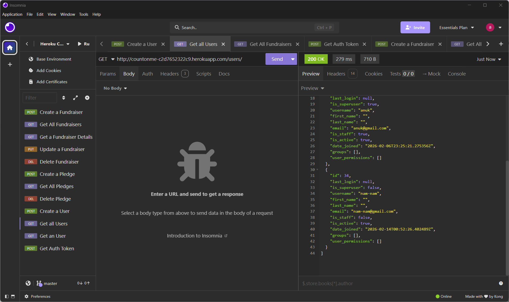
Create a Fundraiser:
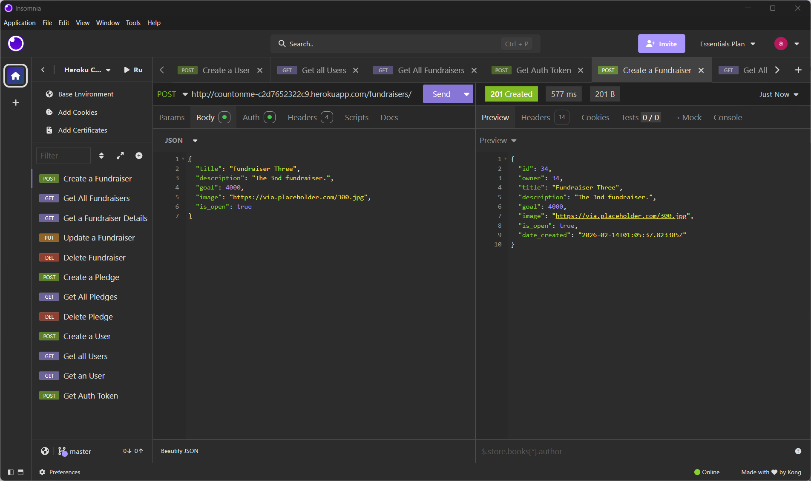
Fundraiser request with auth token:
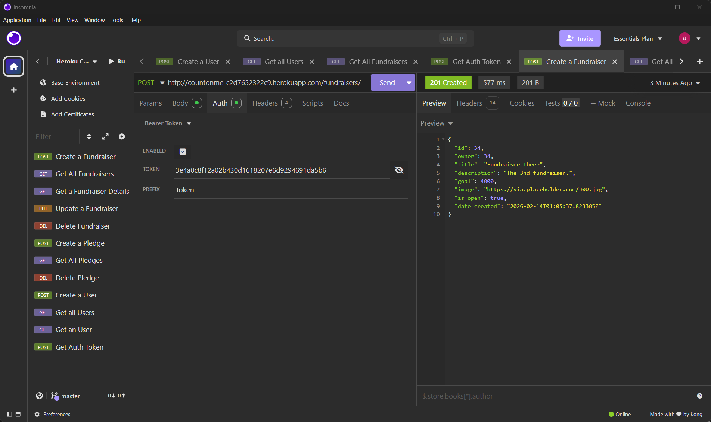
Newly created fundraiser returned in 'Get all Fundraisers'
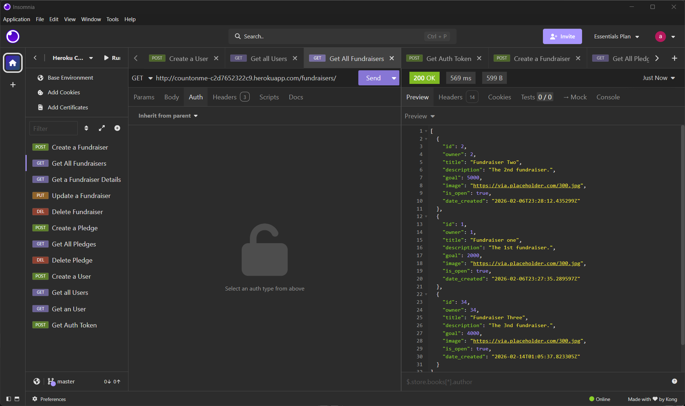
- [x]  A screenshot of Insomnia, demonstrating an unsuccessful POST method to create a fundraiser without authentication.
Failed POST request with NoAuth:

- [x]  A screenshot of Insomnia, demonstrating a successful DELETE method (Only Fundraiser owner can delete a pledge)
Unsuccessful Delete:
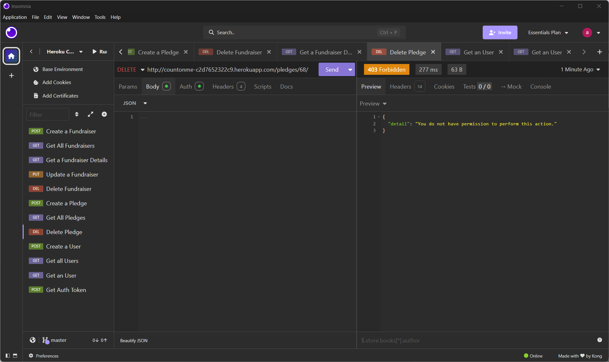
Unsuccessful Delete(No Auth):
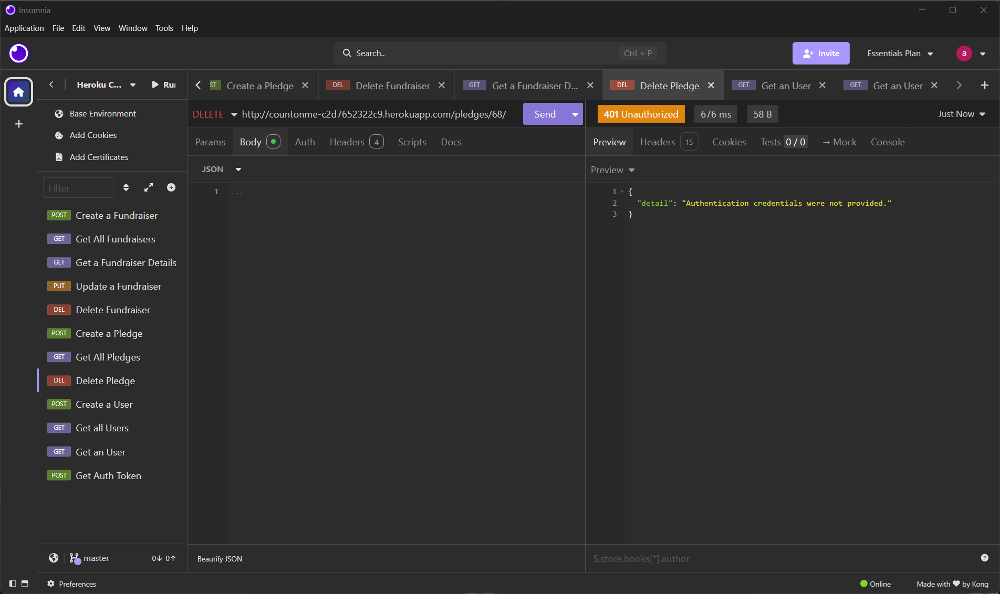
Successful Delete:
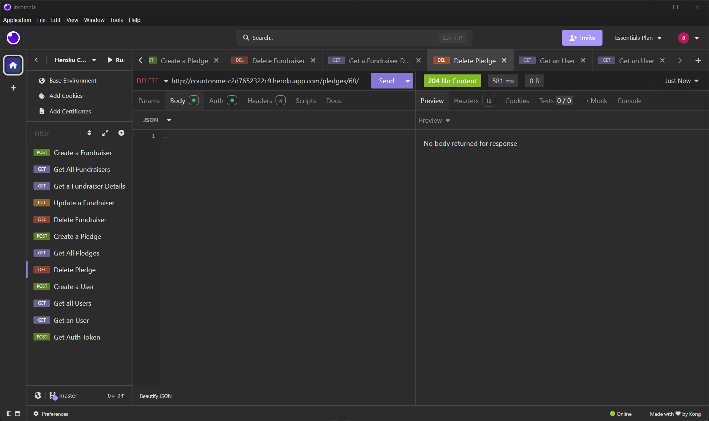
- [x]  A screenshot of Insomnia, demonstrating a pledge can be done without logging in
Pledge with no Auth:
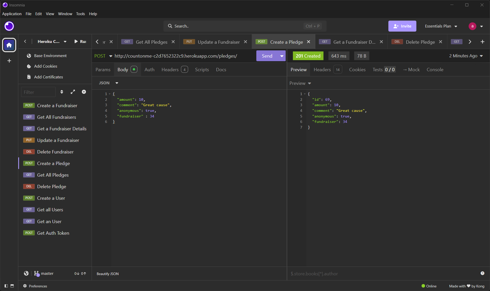
No Supporter id:
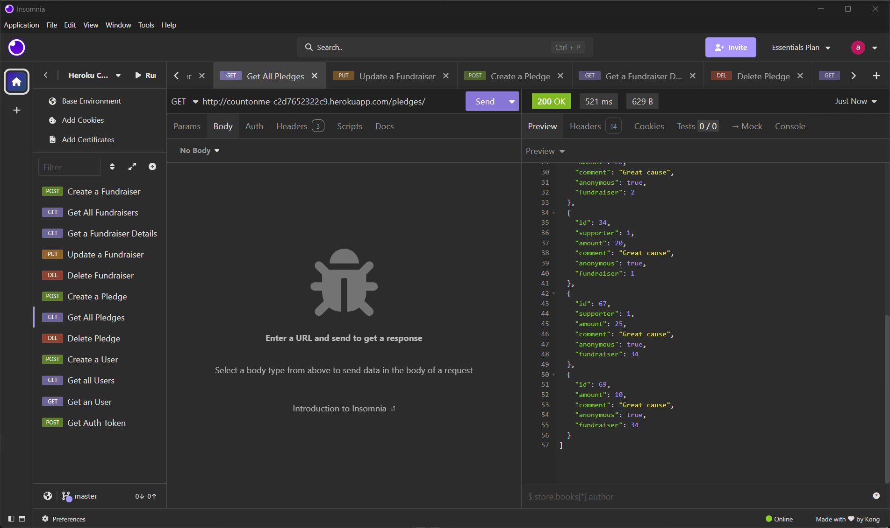

- [x] Your refined API specification and Database Schema.
